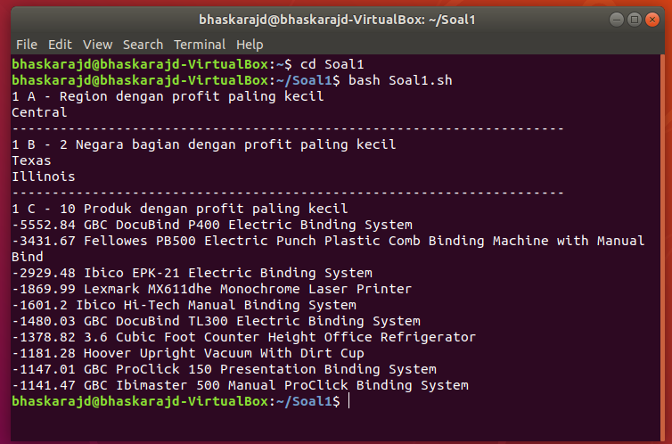

# SoalShiftSISOP20_modul1_T02
Repository Sebagai Laporan Resmi Soal Shift Modul 1 Praktikum Sistem Operasi 2020\
Disusun oleh : I Gde Made Bhaskara Jala Dhananjaya (05311840000007) & Azmi (05311840000047)

# Soal 1 - AWK untuk Menyaring Data
Whits adalah seorang mahasiswa teknik informatika. Dia mendapatkan tugas praktikum untuk membuat laporan berdasarkan data yang ada pada file “Sample-Superstore.tsv”. Namun dia tidak dapat menyelesaikan tugas tersebut. Laporan yang diminta berupa : 

***a.*** Tentukan wilayah Region yang memiliki keuntungan (profit) paling sedikit \
***b.*** Tampilkan 2 negara bagian (state) yang memiliki keuntungan (profit) paling sedikit berdasarkan hasil poin a \
***c.*** Tampilkan 10 produk (product name) yang memiliki keuntungan (profit) paling sedikit berdasarkan hasil poin b 

Whits memohon kepada kalian yang sudah jago mengolah data untuk mengerjakan laporan tersebut.

File untuk penyelesaian soal ini ada disini : [Source Code Soal 1](https://github.com/Bhaskaraa/SoalShiftSISOP20_modul1_T02/tree/master/Soal1)

Untuk menyelesaikan persoalan nomor 1, kami menggunakan syntax code sebagai berikut.
```
#!/bin/bash

echo "1 A - Region dengan profit paling kecil"
awk -F \\t 'FNR>1{array[$13]+=$21}END{for(region in array)print array[region], region}' Sample-Superstore.tsv | sort -g | awk -F " " '{print $2}' | head -n 1
echo "---------------------------------------------------------------------"
echo "1 B - 2 Negara bagian dengan profit paling kecil"
awk -F \\t 'FNR>1{if($13=="Central")array[$11]+=$21}END{for(region in array)print array[region], region}' Sample-Superstore.tsv | sort -g | awk -F " " '{print $2}' | head -n 2
echo "---------------------------------------------------------------------"
echo "1 C - 10 Produk dengan profit paling kecil"
awk -F \\t 'FNR>1{if($11=="Texas" || $11=="Illinois")array[$17]+=$21}END{for(region in array)print array[region], region}' Sample-Superstore.tsv | sort -g | head -n 10

```
## 1A
```
echo "1 A - Region dengan profit paling kecil"
awk -F \\t 'FNR>1{array[$13]+=$21}END{for(region in array)print array[region], region}' Sample-Superstore.tsv | sort -g | awk -F " " '{print $2}' | head -n 1
```

Untuk soal nomor 1a, ditandai dengan `echo "1 A - Region dengan profit paling kecil"`. Kemudian menggunakan `awk -F \\t` untuk blablabla. Kemudian `FNR>1` ***(For Number Rows)*** artinya baris yang dibaca adalah baris yang lebih dari baris pertama (2++). Kemudian `{array[$13]+=$21}` berfungsi untuk memasukan nilai yang ada dalam field 13 ***(field region)*** ke dalam array, lalu nilai yang ada field 21 di-***sum*** atau dijumlahkan semuanya. Kemudian `END{for(region in array)print array[region], region` berfungsi untuk menampilkan region yang ada dalam array beserta dengan jumlah profitnya masing-masing. `Sample-Superstore.tsv` adalah file yang merupakan ***source data***. `sort -g` digunakan untuk mengurutkan output dari yang terkecil dan dari atas. `awk -F " " '{print $2}'` berfungsi untuk memberi pemisah antara field berupa " " (spasi) dan yang di-***print*** hanya field kedua. Dan terakhir `head -n 1` berfungsi untuk menampilkan output baris 1 saja (paling atas).

## 1B
```
echo "1 B - 2 Negara bagian dengan profit paling kecil" 
awk -F \\t 'FNR>1{if($13=="Central")array[$11]+=$21}END{for(region in array)print array[region], region}' Sample-Superstore.tsv | sort -g | awk -F " " '{print $2}' | head -n 2
```

Soal nomor 1b ditandai dengan `echo "1 B - 2 Negara bagian dengan profit paling kecil"`. Sama seperti soal ***1a***, `awk -F \\t` digunakan untuk blablabla. Kemudian, `FNR>1{if($13=="Central")array[$11]+=$21}END{for(region in array)print array[region], region}` artinya untuk untuk baris yang lebih dari baris pertama, jika field 13 ***(Region)*** merupakan ***Central***, field 11 dari Region Central dimasukkan ke dalam array dan field 21 ***(profit)*** dijumlahkan. Output yang dihasilkan adalah data di field 11 ***(State)*** beserta profitnya masing-masing. `sort -g` untuk mengurutkan data dari yang terkecil. `awk -F " " '{print $2}'` berfungsi untuk memberi pemisah spasi diantara field output dan yang di-***print*** field ke 2 saja. `head -n 2` berfungsi untuk menampilkan 2 output teratas. sesuai dengan permintaan soal.

## 1C
```
echo "1 C - 10 Produk dengan profit paling kecil"
awk -F \\t 'FNR>1{if($11=="Texas" || $11=="Illinois")array[$17]+=$21}END{for(region in array)print array[region], region}' Sample-Superstore.tsv | sort -g | head -n 10
```

Soal nomor 1c ditandai dengan `echo "1 C - 10 Produk dengan profit paling kecil"`. Sama seperti persoalan sebelumnya, `awk -F \\t` digunakan untuk blablabla. Kemudian, `FNR>1{if($11=="Texas" || $11=="Illinois")array[$17]+=$21}END{for(region in array)print array[region], region}` artinya untuk untuk baris yang lebih dari baris pertama, jika field 11 ***(Region)*** merupakan ***Texas*** atau ***Illinois***, field 17 ***(product name)*** dari State yang dimaksud dimasukkan ke dalam array dan field 21 ***(profit)*** dijumlahkan. Output yang dihasilkan adalah data di field 17 ***(product name)*** beserta profitnya masing-masing. `sort -g` untuk mengurutkan data dari yang terkecil. Dan `head -n 10` untuk menampilkan 10 data teratas.

## Gambar dibawah ini adalah hasil dari script penyelesaian soal nomor 1.



# Soal 2 - Membuat Password Random dan Mengenkripsi File dengan Ceaser
Suatu siang, laptop Randolf dan Afairuzr dibajak oleh seseorang dan laptop mereka berisi data-data penting. Agar kejadian tersebut tidak terulang kembali, mereka meminta bantuan Whits dan tercetus ide sebagai berikut :

***a.*** Membuat script bash yang mebuat password acak sebanyak 28 karakter yang terdapat huruf kecil, huruf besar, dan angka \
***b.*** Password tersebut disimpan dalam file berektensi .txt dengan nama yang diinputkan hanya terdiri dari karakter alphabet \
***c.*** Kemudian judul file dienkripsi menggunakan Ceaser Cipher yang disesuaikan dengan jam dibuatnya file \
***d.*** Menyertakan script bash untuk mendekripsinya 

Untuk itu, Whits meminta bantuan kalian untuk menyelesaikan persoalan-persoalan diatas.

File untuk penyelesaian soal ini ada disini : [Source Code Soal 2](https://github.com/Bhaskaraa/SoalShiftSISOP20_modul1_T02/tree/master/Soal2)

## 2A dan 2B
Untuk menyelesaikan persoalan nomor 2A, syntax yang digunakan adalah sebagai berikut. 
```
#!/bin/bash

ngasal=`< /dev/urandom  tr -dc A-Za-z0-9 | fold -w 28 | head -n 1`

echo "Tulis Judul Filenya :"
read name
judul=`echo "$name" | tr -dc A-Za-z`
echo "$ngasal" >> $judul.txt
```
## 2C
Untuk menyelesaikan persoalan nomor 2C, syntax yang digunakan adalah sebagai berikut. 
```
#!/bin/bash

for namafile in $@
  do
   waktu=`date +%H -r $namafile`
   namafilelama=`basename $namafile .txt`

   namafilebaru=`echo $namafilelama | caesar $waktu`
   mv $namafile $namafilebaru.txt
 done
 ```
  
  ## 2D
  Untuk menyelesaikan persoalan nomor 2D, syntax yang digunakan adalah sebagai berikut. 
  ```
  #!/bin/bash

for judul in $@
  do
   waktu=`date +%H -r $judul`
   judullama=`basename $judul .txt`
   waktubaru=`expr 26 - $waktu`
   judulbaru=`echo $judullama | caesar $waktubaru`
   mv $judul $judulbaru.txt
done
```

# Soal 3
Kusuma telah sering dicampakkan oleh pujaan hatinya sehingga kalian berniat untuk menghiburnya dengan mengirimkan foto kucing kepadanya. Kemudian kalian memiliki ide sebagai berikut :

***a.*** Mengunduh 28 gambar dari "https://loremflickr.com/320/240/cat" dengan command ***wget*** dengan format nama file "pdkt_kusuma_NO" dan menyimpan ***log messages wget*** kedalam file ***wget.log***. \
***b.*** Menggunakan crontab untuk melakukan menjalankan script setiap 8 jam sekali dimulai pukul 06.00 setiap hari kecuali Hari Sabtu \
***c.*** Karena gambar yang diunduh bersifat random, jika ada gambar yang sama/identik, sisakan 1 gambar untuk Kusuma dan masukan gambar tersebut folder "kenangan" dengan format penamaan "kenangan_NO", sedangkan gambar identik lainnya dimasukan ke folder "duplikasi" dengan format penamaan file "duplikasi_NO" \
Hint : gunakan ***wget.log*** untuk membuat ***location.log*** yang isinya adalah hasil dari grep "Location:". 

Untuk itu kalian diminta untuk membantu menenangkan hati Kusuma :)

File untuk penyelesaian soal ini ada disini : [Source Code Soal 3](https://github.com/Bhaskaraa/SoalShiftSISOP20_modul1_T02/tree/master/Soal3)

## 3A
Untuk menyelesaikan persoalan nomor 3a, syntax yang digunakan adalah sebagai berikut.
```
#!/bin/bash/

banyakfile=`ls | grep "pdkt_kusuma" | cut -d '_' -f 3 | sort -n | tail -1`
if [[ $banyakfile =~ [^0-9] ]] 
  then
  banyakfile=0
fi

awal=`expr $banyakfile + 1`
akhir=`expr $banyakfile + 28`

for ((i=awal;i<=akhir;i++))
do
  wget -O "pdkt_kusuma_$i" -a wget.log "https://loremflickr.com/320/240/cat"
done

grep "Location" wget.log >> location.log
```
## 3B
Untuk menyelesaikan persoalan nomor 3b, syntax yang digunakan adalah sebagai berikut.
```
5 6,14,22 * * 0-5 /bin/bash /home/bhaskarajd/Soal3/Soal3.sh
```

## 3C
Untuk menyelesaikan persoalan nomer 3c, syntax yang digunakan adalah sebagai berikut.


 
